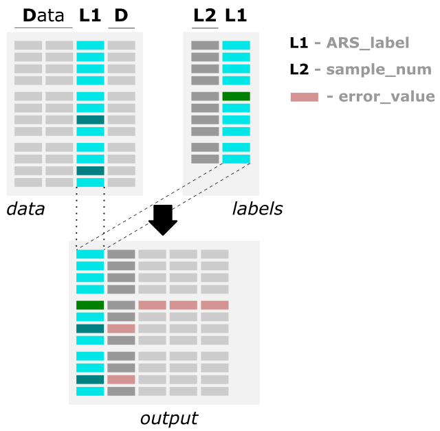
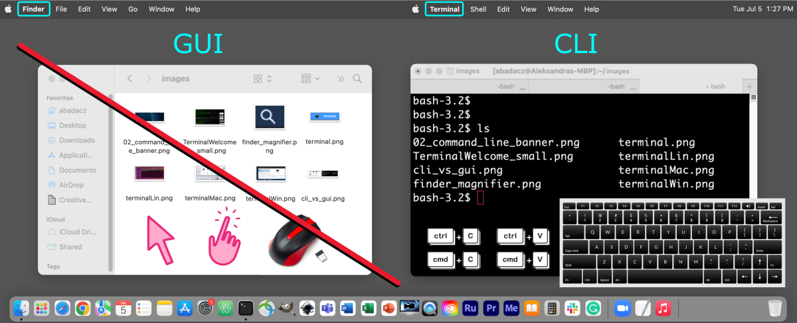
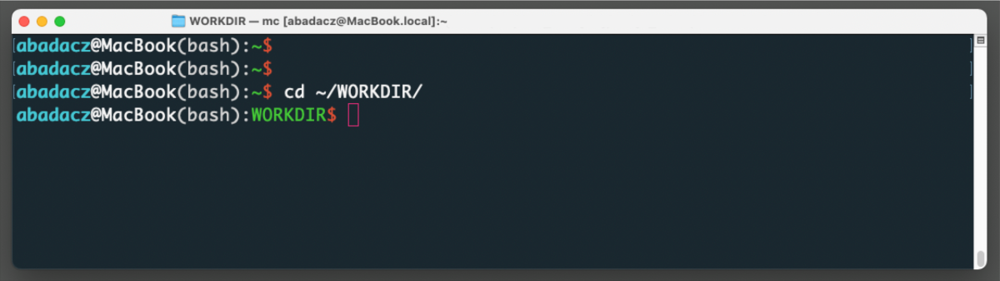
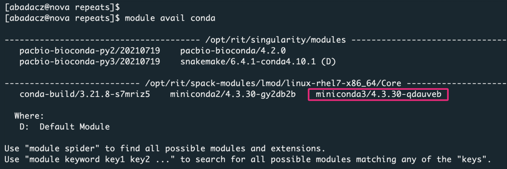
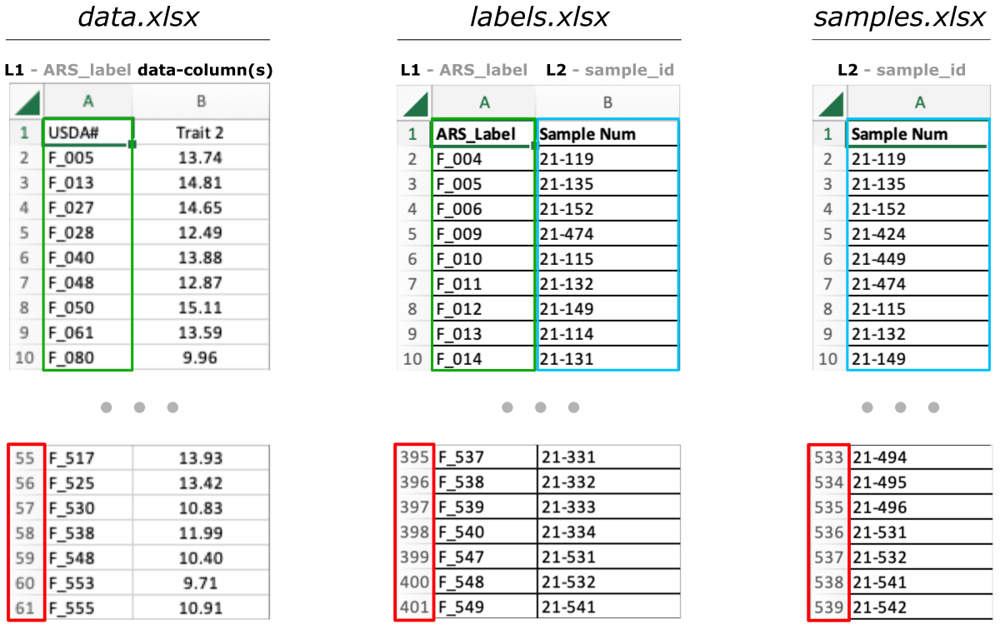
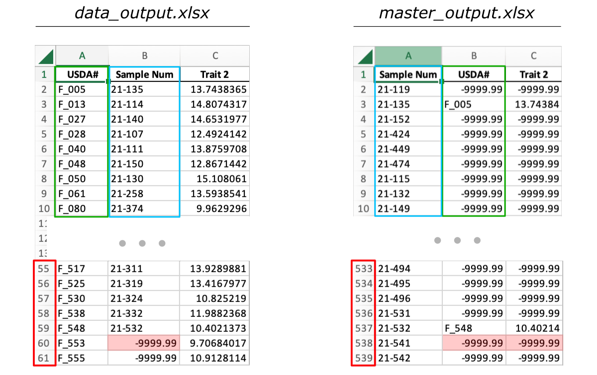

# 2022_Bean_mergeData
**Merge 2 files by a common column.**<br>
*Add missing labels from the reference 2-column (matching label pairs) file into the data file.*

<table>
  <tr> <th>Algorithm</th> <th>Notes</th> </tr>
  <tr> <td>
        <br>
        <i>The figure shows the algorithm of merging two files by common column.</i>
       </td> <td>
        <li> both input files [<i>data, labels</i>] should be a column-like text file </li>
        <li> both input files should include a matching <b>label-column</b> (<i>with the same values</i>) </li>
        <li> the header of <b>label-column</b> [<i> L1 </i>] may be different in each file </li>
        <li> the automatically created <b>output</b> file contains all columns from the <b>data</b> file and additional column [<i> L2 </i>] of matching sample numbers from the <b>labels</b> file </li>
        <li> if some labels pairs are missing in the <b>labels</b> file, the corresponding fields in the [<i> L2 </i>] column of the <b>output</b> file are filled with <b>error_value</b> </li>
        <li> if <b>labels</b> file contains some additional labels pairs (with no correponding data in the <b>data</b> file), the corresponding data fields in the <b>output</b> file are filled with pre-set <b>missing_value</b> (<i>-9999.99 by default, user can customize it</i>) </li>
    </td> </tr>
</table>


### App description
The application enables: <br>
1) adding matching labels from the reference file of label pairs into the data file, <br>
2) transfering annotated data into the original (master) file of samples with assigned *error_value=-9999.99* for missing data. <br>

### Inputs
The user has to provide input files:
* **[ labels ]** - a 2-column file with pairs of corresponding labels (e.g., ARS label and Sample num)
* **[ data ]** - a multi-column file annotated with one of the reference labels (e.g., ARS label)
* **[ samples ]** - optionally, a 1-column file with the list of all samples (e.g., Sample num) <br> *when the file is provided the additional output will be generated automatically and it will contain the data assigned to the original samples while missing data fields will be filled with error_value*

The user has to determine:
* the index of **label column** in the **[ data ]** file; <br>*by default, the algorithm assumes it is the first column in the data file (indexing starts from 0)*

The user can customize:
* the **output filename and format** of exported data; <br>*by default the filename is `data_output-$date` and it is exported as an Excel file (.xlsx)*

### Requirements: **python3, pandas, openpyxl**, conda (*optionally*)

<div style="background: #cff4fc; padding: 15px;">
<span style="font-weight:800;">PRO TIP:</span>
<br><span style="font-style:italic;"> If you do NOT want to use <b>Conda</b>, but have python3 already installed, install the remaining requirements directly: <br>
<code>
pip3 install pandas <br>
pip3 install openpyxl
</code>
</span>
</div><br>


# Hands-on tutorial

The `data_matcher.py` is a ready-made mini application written in Python programming language. Technically, it is a block of code, without the graphical user interface (GUI), and it needs to be executed from the command line (CLI) in the terminal window.

 <br>
<b>Figure. </b> <i>In the graphical user interface (GUI, on the left), you use a mouse to navigate the file system and execute applications by clicking, while in the command-line interface (CLI, on the right), you type text-like commands on your keyboard to do the same (and much more!).</i>

<div style="background: #cff4fc; padding: 15px;">
<span style="font-weight:800;">PRO TIP:</span>
<br><span style="font-style:italic;"> If you are not familiar with the <b>Command-line Interface (CLI)</b> and the basics of working in the terminal window, start by exploring the <a href="https://datascience.101workbook.org/02-IntroToCommandLine/01-terminal-basics" target="_blank">Terminal: the command-line interface  ⤴</a> tutorial, available in the <a href="https://datascience.101workbook.org" target="_blank">Data Science Workbook  ⤴</a>. You can also learn more about the <a href="https://datascience.101workbook.org/02-IntroToCommandLine/02-intro-to-unix-shell.html" target="_blank">Unix Basics  ⤴</a> from another tutorial.</span>
</div><br>


## Setting up the computational environment

### A. On your local machine

1. Open terminal window: <a href="https://datascience.101workbook.org/02-IntroToCommandLine/01-terminal-basics#open-terminal-window" target="_blank">see instructions here  ⤴</a>
2. Install Python3
* <a href="https://realpython.com/installing-python/#how-to-install-on-ubuntu-and-linux-mint" target="_blank">Installing on Linux  ⤴</a> Below quick guide for Ubuntu:
```
sudo apt-get update
sudo apt-get install python3.9 python3-pip
```
* <a href="https://realpython.com/installing-python/#how-to-install-python-on-windows" target="_blank">Installing on Windows  ⤴</a>
* <a href="https://realpython.com/installing-python/#how-to-install-python-on-macos" target="_blank">Installing on macOS  ⤴</a> Below quick guide for Homebrew-based installation:
```
/bin/bash -c "$(curl -fsSL https://raw.githubusercontent.com/Homebrew/install/master/install.sh)"
brew update && brew upgrade
brew install python3
```

3. Install <a href="https://docs.conda.io/projects/conda/en/latest/index.html" target="_blank">Conda  ⤴</a>, an open-source and cross-platform environment management system.
* <a href="https://docs.conda.io/projects/conda/en/latest/user-guide/install/linux.html" target="_blank">Installing on Linux  ⤴</a>
* <a href="https://docs.conda.io/projects/conda/en/latest/user-guide/install/windows.html" target="_blank">Installing on Windows  ⤴</a>
* <a href="https://docs.conda.io/projects/conda/en/latest/user-guide/install/macos.html" target="_blank">Installing on macOS  ⤴</a>
* <a href="https://datascience.101workbook.org/03-SetUpComputingMachine/03A-tutorial-installations-on-mac#-install-conda" target="_blank">Installing on MacBook Pro (both versions: ARM and x86) ⤴</a>

Test your Conda installation by typing in the terminal window:
```
conda info
```

On the screen your Conda settings should be displayed. Otherwise, if a `command not found` error is thrown back, you need to fix the Conda installation step.

4. Set up Conda environment

* A) create the `data_wrangling` virtual environment:
```
conda create -n data_wrangling python=3.9
```
* B) activate the `data_wrangling` environment:
```
conda activate data_wrangling
```

 <br>
*Once the environment is active, you can see its name preceding the prompt.*

* C) install new dependencies within environment:
```
pip3 install pandas
pip3 install openpyxl
```

5. Navigate to your workspace on the file system using the `cd` command followed by the <b>path</b> to the desired location. For example, if you want to create a new working directory in your $HOME location, copy-paste the following commands:
```
mkdir ~/WORKDIR
cd ~/WORKDIR
```



### B. On HPC infrastructure (*Ceres, Atlas, and other clusters*)

1. Open terminal window: <a href="https://datascience.101workbook.org/02-IntroToCommandLine/01-terminal-basics#open-terminal-window" target="_blank">see instructions here  ⤴</a>
2. Log in to the remote computing infrastructure using the `ssh` command. Learn more about the <a href="https://datascience.101workbook.org/06-IntroToHPC/02-SSH/01-secure-shell-connection" target="_blank">Secure Shell Connection  ⤴</a> from the tutorial in the <a href="https://datascience.101workbook.org" target="_blank">Data Science Workbook  ⤴</a>.

* log in to Atlas:
```
ssh <user.name>@atlas-login.hpc.msstate.edu
```
* log in to Ceres:
```
ssh <user.name>@ceres.scinet.usda.gov
```

3. Load Conda module:
* A) search for `conda` modules
```
module avail conda
```



* B) load selected module variant
```
module load miniconda3/4.3.30-qdauveb
```

4. Set up Conda environment

* A) create the `data_wrangling` virtual environment:
```
conda create -n data_wrangling python=3.9
```
* B) activate the `data_wrangling` environment:
```
source activate data_wrangling
```

* C) install new dependencies within environment:
```
pip3 install pandas
pip3 install openpyxl
```

5. Navigate to your workspace on the file system using the `cd` command followed by the **path** to the desired location. On the SCINet HPC clusters your workspace should be located on the path: <b>/project/</b>{project_account}/{user}/{workdir}.
```
cd /project/< provide-here-path-to-your-project-account >
```


## Download Python mini app

1. Make sure you are in your workspace on the file system using the `pwd` command.

2. Download the <b>2022_Bean_mergeData</b> repository from the GitHub:

* if you use `git` already:
```
git clone https://github.com/ISUgenomics/2022_Bean_mergeData.git
```

<div style="background: #cff4fc; padding: 15px; margin-left: 2.8em;">
<span style="font-weight:800;">PRO TIP:</span>
<br><span style="font-style:italic;"> If you tried the command above and received an error message <b>command not found</b>, you do NOT have <code>GIT</code> installed. Then, if working on your local machine, follow instructions provided at <a href="https://git-scm.com/book/en/v2/Getting-Started-Installing-Git" target="_blank">git-scm.com : 1.5 Getting Started - Installing Git  ⤴</a>.</span>
</div><br>

In the downloaded repo, you will find: the **app** and **example_dataset** folders, containing the `data_matcher.py` Python script and input files, respectively.

* alternatively, you can download directly only the necesary files (*app script + example inputs*):
```
wget https://raw.githubusercontent.com/ISUgenomics/2022_Bean_mergeData/main/app/data_matcher.py
wget https://github.com/ISUgenomics/2022_Bean_mergeData/raw/main/example_dataset/data.xlsx
wget https://github.com/ISUgenomics/2022_Bean_mergeData/raw/main/example_dataset/labels.xlsx
wget https://github.com/ISUgenomics/2022_Bean_mergeData/raw/main/example_dataset/samples.xlsx
```

## Options available in the application

```
python3 data_matcher.py -l labels -f data
                        [-t samples]
                        [-c col]
                        [-o format] [-n outfile] [-m master]
                        [-h]
```

*^ arguments provided in square brackets [] are optional*

help & info arguments:
```
-h,          --help                         # show this help message and exit
```

required arguments:
```
-l labels,   --labels-filename labels       # [string] input 2-col file in the xlsx format; required
-f data,     --data-file data               # [string] input multi-col file in the xlsx format; required
```

optional arguments:<br>
```
-t samples,  --master-file samples          # [string] input Master Excel (samples) file in the xlsx format; optional
-c col,      --label-column col             # [int]    index of the label column in the data_file; default=0
-o format,   --output-format format         # [int]    select format for output file: 0 - xlsx, 1 - csv; default=0
-n outfile,  --output-filename outfile      # [string] provide custom name for the output file; default="data_output"
-m master,   --output-masterfile master     # [string] provide custom name for the output master_file; default: "master_output"
```

*defaults for optional arguments:*
```
-t ''                                       # means: no samples file is provided
-c 0                                        # the column of index 0 in [ data ] file is assumed to contain labels
-o 0                                        # output is saved in the .xlsx (Excel) format
-n "data_output"                            # output is saved in the "data_output.xlsx" file
-m "master_output"                          # output master_file is saved in the "master_output.xlsx" file
```


## Example usage:<br>

### Inputs

Below is the preview of the required `data` and `labels` input files, as well as the optional `samples` file. The <b>data</b> and <b>labels</b> share the same column with *ARS labels*, even though in both files this column has a different name (i.e., *USDA#* and *ARS_Label*, marked with the green frames). The <b>labels</b> file contains an additional column with `sample IDs` paired with the `ARS labels`. As you can see, the number of rows in the <b>labels</b> file is significantly higher than inthe <b>data</b> file. And finally, the <b>samples</b> file is much longer because it contains all the pre-set sample identifiers.



### Tasks

There are two tasks to performe:
1. [REQUIRED] Adding matching `sample IDs` from the <b>labels</b> file into the <b>data</b> file. The **data_output** file size is equal to the <b>data</b> input file.
2. [OPTIONAL] Transfering <b>data</b> into the original <b>samples</b> (master) file  with assigned `error_value=-9999.99` for missing data hits. The **master_output** file size is equal to the <b>samples</b> input file.




### Practical Examples


<b>NOTE:</b>
<br><i>
Depending on your operating system and Python configuration, you should use a <b>python</b> or <b>python3</b> keyword to indicate the correct interpreter for the "data_matcher.py" script. <br>
The script requires <b>Python 3.8</b> or later release. To check the version of your Python installation, type in the terminal or command prompt:</i>
```
python --version
```
<i>If the returned Python version is lower than 3.8, try again by typing:</i>
```
python3 --version
```
<i>If the returned value is still lower than 3.8, then you need to install a new instance of Python in version 3.8 or newer.</i>


<b>PRO TIP:</b> <br>
<i>
You can use all built-in flags [-l, -f, -t, -c, -n, -m, -o] for a given script run but each of them only once. <b>The value following the flag can be customized by users depending on their needs and the datasets used.</b> The type of values matching the flags are specified in the <a href="https://github.com/ISUgenomics/2022_Bean_mergeData#options-available-in-the-application">Options available in the application</a>. For files (inputs and outputs), they should be a string, while for all other parameters, they should be an integer.
</i>


<b>For the purpose of this tutorial, we use simplified names of input and output files to make it easier for the user to know which flag matches each file type.</b> So, please feel free to use your original or customized filenames without renaming them to <i>"labels.xlsx", "data.xlsx",</i> and <i>"samples.xlsx"</i>.

<br>

**1. Minimal arguments to generate `data_output`:**

```
python3 data_matcher.py -l labels.xlsx -f data.xlsx
```
<i>This run will generate a single file with a name randomized by a current date in the format day-month-year-seconds, e.g.,</i> `data_output-17-03-2023-104731.xlsx`

<br>

**2. Minimal arguments to generate `data_output` and `master_output`:**

```
python3 data_matcher.py -l labels.xlsx -f data.xlsx -t samples.xlsx
```
<i>This run will generate two files with names randomized by a current date in the format day-month-year-seconds, e.g.,</i> `data_output-17-03-2023-104731.xlsx` *and* `master_output-17-03-2023-104731.xlsx`

<br>

**3. Customize names of the output files:**
  * use `-n` flag to change the name of the `data_output` file
  * use `-m` flag to change the name of the `master_output` file

```
python3 data_matcher.py -l labels.xlsx -f data.xlsx -t samples.xlsx -n cutom_data_output -m cutom_master_output
```
<br><b>NOTE:</b>
<br><i>The user-provided filenames can be randomized by a variable, for example depending on the date (added as a unique tag):</i>
```
-n custom_name-$(date +"%d-%m-%Y-%s")
```

<br>

**4. Specify the index of the label column in the `data` file:**

* use `-c` flag followed by the index of the **label** column, if other than the first column, i.e., 0 *(in Python, indexing starts from 0 instead of 1)*

```
python3 data_matcher.py -l labels.xlsx -f data.xlsx -c 2
```
<i>In this variant, the script will assume that the label column is a third column in the <b>"data"</b> file. This column has the index=2 because in Python we count from 0: 0 (first), 1 (second), and 2 (third). When the flag <b>-c</b> is NOT used, the script assumes that the label column is the first column with index 0.</i>

<br>

**5. Customize the format of the output files**

* use `-o` flag to select the format of the output files: 0 - xlsx, 1 - csv; default=0

```
python3 data_matcher.py -l labels.xlsx -f data.xlsx -o 1
```
<i>This run will save the <b>"output_data"</b> file in CSV format instead of the Excel file (.xlsx). When the <b>-o</b> flag is NOT used, the script saves all outputs in the default Excel format.</i>

<br>

**6. Example of the fully customized run:**

```
python3 data_matcher.py -l reference_labels.xlsx -f our_data.xlsx -t experimental_samples.xlsx -n cutom_data_output -m cutom_master_output -c 1 -o 1
```
<i>This run will use three input files (with their original names), all located in the same directory as the data_matcher.py script. The run is executed from within this directory. The second column (so with index 1) from the data file provided with the <b>-f</b> flag will be used as a label column. Two output files will be generated, both with names provided by the user after the corresponding flags (<b>-n</b> and <b>-m</b>). Both files will be saved in CSV format instead of the default Excel format.</i>

<br>

**7. You can run the script from any location in the file system:**

There is no need to copy the Python script into each directory with a new dataset. You can store this and other scripts in a selected location in the file system. For example, create the `PYTHON_SCRIPTS` directory in your home directory by typing:
```
mkdir ~/PYTHON_SCRIPTS
cd ~/PYTHON_SCRIPTS
```
Then, download the current version of the python script from the GitHub repository:
```
wget https://raw.githubusercontent.com/ISUgenomics/2022_Bean_mergeData/main/app/data_matcher.py
```

or if you have it already, then copy it locally using the `cp data_matcher.py ~/PYTHON_SCRIPTS/` command in the location where the script is stored.

Then, navigate to the location of your dataset, replacing the content of the `< >` with the path to the selected directory:
```
cd <path/to/your/dataset>
```

Now, you are ready to call the script in the external location by specifying its path:
```
python3 ~/PYTHON_SCRIPTS/data_matcher.py -l reference_labels.xlsx -f our_data.xlsx -t experimental_samples.xlsx -n cutom_data_output -m cutom_master_output -c 1 -o 1
```
*If you place the script on different path (i.e., in different location) than ~/PYTHON_SCRIPTS/, then you need to provide the corresponding path instead of the one from this example. You can also provide an individual path to each file (input or output) if they are stored in a different location than your current workdir (i.e., the location from which you run the command).*


## Input data and outputs

**data_output**<br>
The exact copy of the input datafile [*data.xlsx*] with one additional column (next to the ARS label) is created [*output.xlsx* by default]. The new column contains the corresponding sample label. If there is no matching sample label, the error value -f -9999.99 is assigned.

**master_output**<br>
The exact copy of the input sample file [*sample.xlsx*] (containing the sample labels) is extended of the corresponding ARS label and all remaining data columns (taken from data_file). If there is no matching hit for a sample label, the values in the new columns will contain the default (-9999.99) for the missing data.

Files description:<br>

|file | description|
|-----|------------|
|Original_Sample_Master_List.xlsx **[samples.xlsx]** | original **sample labels** of experimental data |
|F-set_complete.xlsx **[labels.xlsx]**| list of matching labels pairs; 2-column file |
|Sample_Data_by_ARS_F-number.xlsx| data annotated with **ARS label** |
|Sample_check_by_F-number.xlsx **[data.xlsx]**| data annotated with **ARS label** |
|data_matcher.py| python script |
